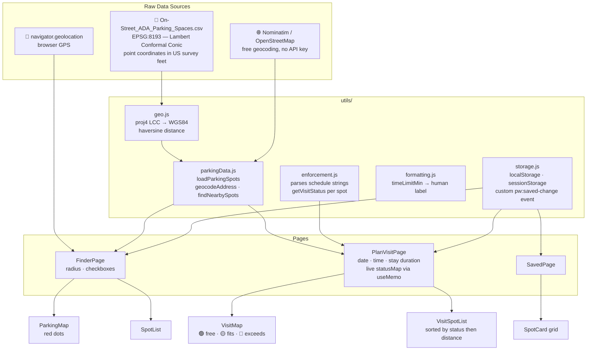

# Madison ParkWise

> Find, filter, and plan around ADA-accessible on-street parking in Madison, WI.

[](https://react.dev)
[](https://vitejs.dev)
[](https://getbootstrap.com)
[](https://leafletjs.com)

---

## Overview

Madison ParkWise is a single-page application that puts the City of Madison's ADA parking data on an interactive map, adds a time-aware planner, and lets users bookmark spots for later. It was built as a course project for CS571 at UW–Madison, with an emphasis on accessibility (WCAG AA), component architecture, and working with real open-data sources.

The app ingests the City of Madison's ADA parking dataset, normalizes it, and surfaces it through four pages — each designed around a distinct user intent.

---

## Pages

| Page | Intent |
|---|---|
| **Finder** | Explore ADA spots near an address or GPS location |
| **Plan a Visit** | See which spots are actually usable at a specific date, time, and stay duration |
| **Saved** | Manage bookmarked spots across sessions |
| **About** | Data sources, coordinate projection notes, tech stack |

---

## Features

- **Time-aware planning** — enforcement schedules are parsed and evaluated against your planned arrival time; map dots update live in green / orange / red as you adjust the time or stay duration
- **Interactive map** — OpenStreetMap tiles via React Leaflet; click any dot to save a spot or open Google Maps directions
- **Search history** — last 5 addresses stored in `localStorage`, shown in a dropdown on input focus
- **Saved spots** — persisted to `localStorage`; count badge on the nav link updates reactively via a custom DOM event
- **Session persistence** — Finder state (address, radius, filters, search coords) survives navigation via `sessionStorage`
- **Keyboard navigable** — every interactive list item has `role="button"`, `tabIndex`, and `onKeyDown`; focus rings are visible and inset
- **Screen reader friendly** — `aria-live` on result counts, `aria-label` on all icon buttons, strict `h1 → h2 → h3` heading hierarchy

---

## Data Flow



---

## Component Tree

```
App
├── PrimaryNav           (saved-count badge via useSavedCount hook)
├── FinderPage
│   ├── SearchFilters    (location toggle, radius, checkboxes, history dropdown)
│   ├── SpotList         (scrollable, keyboard navigable, click-to-fly)
│   └── ParkingMap
│       ├── MapFlyTo     (Leaflet flyTo effect)
│       ├── MapLegend    (configurable items prop)
│       └── SpotPopup    (save + Google Maps directions)
├── PlanVisitPage
│   ├── VisitFilters     (address, date, time, stay duration, radius)
│   ├── VisitSummary     (aria-live count pills)
│   ├── VisitSpotList    (status-sorted, colored rows)
│   ├── VisitMap
│   │   ├── MapFlyTo
│   │   ├── MapLegend
│   │   └── SpotPopup
│   └── EmptyState
├── SavedPage
│   ├── SpotCard         (copy address, remove)
│   └── EmptyState
└── AboutPage
```

---

## Tech Stack

| Layer | Library / Tool | Why |
|---|---|---|
| Framework | React 19 | Concurrent features, stable hooks API |
| Build | Vite 8 | Sub-second HMR, ESM-native |
| UI | React Bootstrap 2 (Bootstrap 5) | Accessible components, responsive grid |
| Routing | React Router 7 | Declarative client-side routing |
| Map | React Leaflet 5 + Leaflet 1.9 | OpenStreetMap tiles, no API key |
| Coordinates | proj4 | EPSG:8193 Lambert Conformal Conic → WGS84 |
| Geocoding | Nominatim (OpenStreetMap) | Free, CORS-enabled, no key required |
| Deployment | GitHub Pages (`/p30/`) | `vite build` → `docs/` via `base: '/p30/'` |

---

## Data Source

### ADA Parking Spaces (`On-Street_ADA_Parking_Spaces.csv`)

Source: [City of Madison Open Data Portal](https://data.cityofmadison.com) — *On-Street ADA Parking Spaces*

Point geometries stored in **EPSG:8193** (NAD83(HARN) / WISCRS Dane County, US survey feet — Lambert Conformal Conic). The proj4 string is sourced from [epsg.io/8193](https://epsg.io/8193) and applied via the `proj4` library to convert each `(X, Y)` pair to WGS84 `(lat, lng)`.

Enforcement schedules use a compact notation (`8a-6p M-F`, `7:30a-1p Su Only`, `Sa-Su`, `24 Hours`) that is parsed by `enforcement.js` into day-index sets and minute-from-midnight ranges.

---

## Getting Started

```bash
# Install dependencies
npm install

# Start the dev server (served at http://localhost:5173/p30/)
npm run dev

# Production build → docs/ (GitHub Pages ready)
npm run build

# Lint
npm run lint
```

---

## Project Structure

```
src/
├── App.jsx                        # Router shell, nav, footer
├── constants.js                   # RADIUS_OPTIONS
├── main.jsx
│
├── components/
│   ├── AboutPage.jsx
│   ├── EmptyState.jsx             # Reusable empty/zero-state card
│   ├── FinderPage.jsx             # Main search page — owns all finder state
│   ├── MapFlyTo.jsx               # Leaflet useMap effect (search + spot selection)
│   ├── MapLegend.jsx              # Configurable map overlay legend
│   ├── ParkingMap.jsx             # Finder map (red dots, blue origin)
│   ├── PlanVisitPage.jsx          # Time-aware planner — statusMap via useMemo
│   ├── PrimaryNav.jsx             # Navbar with live saved-count badge
│   ├── ResultsHeader.jsx          # aria-live count + radius badge
│   ├── SavedPage.jsx
│   ├── SearchFilters.jsx          # Finder filter card
│   ├── SpotCard.jsx               # Saved-page spot card (copy + remove)
│   ├── SpotList.jsx               # Scrollable finder list, click-to-fly
│   ├── SpotPopup.jsx              # Leaflet popup (save + directions)
│   ├── VisitFilters.jsx           # Planner form card
│   ├── VisitMap.jsx               # Planner map (status-colored dots)
│   ├── VisitSpotList.jsx          # Status-sorted scrollable list
│   └── VisitSummary.jsx           # Green / orange / red count pills
│
├── hooks/
│   ├── useGeolocation.js          # GPS state machine (idle→requesting→granted/denied)
│   └── useSavedCount.js           # Reactive count via pw:saved-change event
│
└── utils/
    ├── enforcement.js             # Schedule parser + getVisitStatus()
    ├── formatting.js              # formatTimeLimit() (minutes → "2-hour limit")
    ├── geo.js                     # proj4 EPSG:8193 definition, haversine distance
    ├── parkingData.js             # CSV loader, geocoder, proximity search
    └── storage.js                 # localStorage (saved spots, search history),
                                   # sessionStorage (finder state)
```

---

## Key Technical Notes

**Coordinate projection** — The ADA dataset uses EPSG:8193, a Lambert Conformal Conic CRS specific to Dane County. The proj4 definition was sourced directly from `epsg.io/8193.proj4` to avoid the ~68m accuracy loss that results from using an approximated Transverse Mercator fallback.

**Enforcement parsing** — `enforcement.js` parses the five schedule patterns present in the ADA dataset into a composable structure: time range → day set → minute-from-midnight check. All 16 edge cases (boundary conditions, wrap-around ranges like `Sa-Su`) pass the inline smoke test.

**Live badge count** — The "Saved" nav badge does not use React Context. Instead, `persistSave` and `persistRemove` dispatch a `pw:saved-change` custom DOM event, and `useSavedCount` subscribes to it. This keeps the architecture flat while still enabling cross-tree reactivity.
